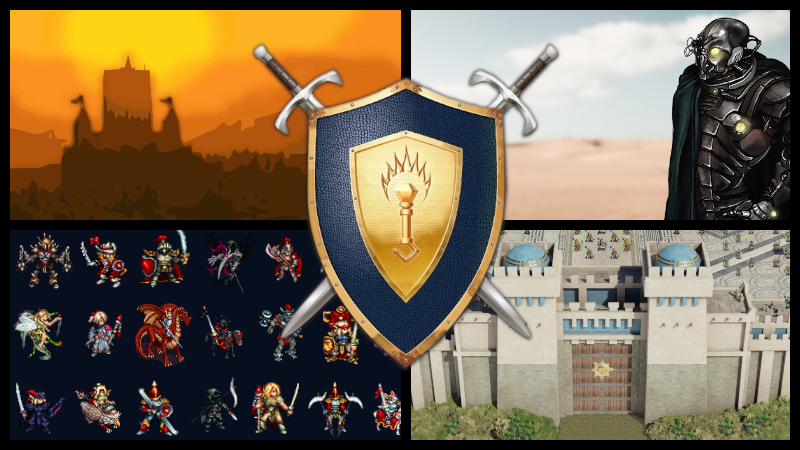
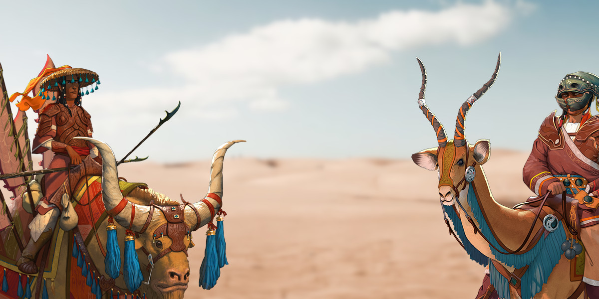
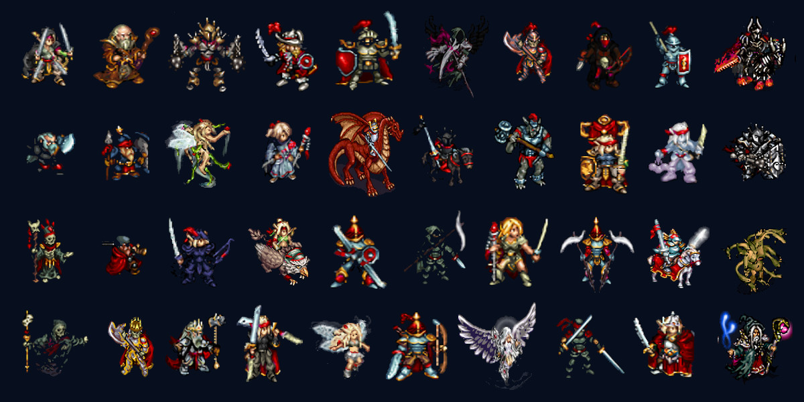
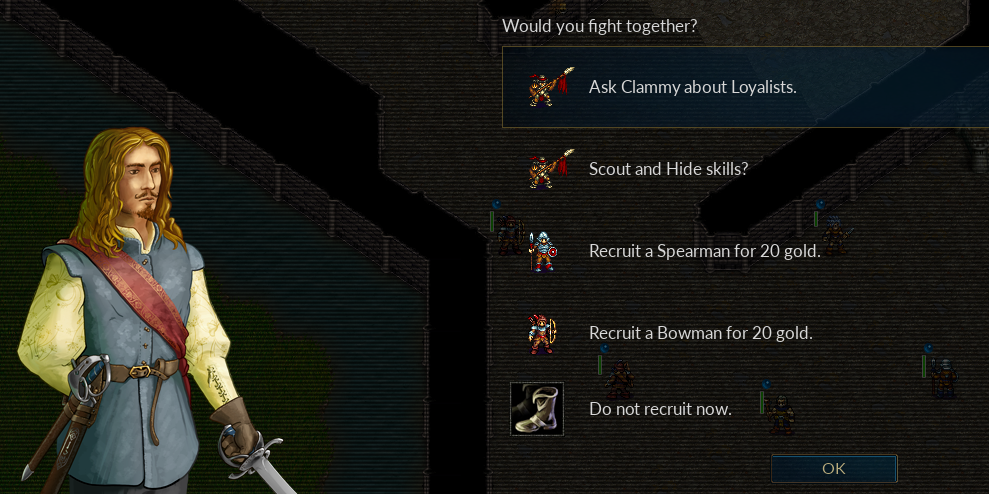
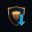

# Continue your adventure with the most popular campaign add-ons

Battle for Wesnoth comes with almost 20 single-player campaigns set in the wide green world of [Irdya](https://wiki.wesnoth.org/Geography_of_wesnoth). You can play as a young heir fighting to restore his throne, a king desparate to save his people, or the instigator of a peasant revolt. You can lead a dwarven expedition to uncover a lost relic in one campaign. Or crush the rivals of your Orcish clan to unite the Great Horde in another. You can even play as wayward magi drawn inexoribly, disastrously to the darkest of their arts.

There is no central hero who dominates the history of the Great Continent and no single story around which the world pivots. Like the best fan-fiction, Wesnoth's lore is made up of many voices with many stories to tell.

As a result, our user community has written more than 100 campaign add-ons. Many of these are set in Irdya and expand upon little-explored races or fill in gaps in the game's [timeline](https://wiki.wesnoth.org/Timeline_of_Wesnoth). Others are set in their own universe.

In this post, we want to celebrate the most popular user-made campaigns available on the add-on server. The stories these campaigns tell are not part of Wesnoth's "canon" -- what we call the official lore -- but each one has been a hit with our player community.

## Invasion from the Unknown and After the Storm (14,800+ downloads)

These campaigns continue the story told in **Under the Burning Suns**, Wesnoth's only official campaign set in the distant future after the Fall. Written by our most successful add-on developer, Iris Morelle (Irydacea/shadowm), [Invasion from the Unknown](https://r.wesnoth.org/t43309) and [After the Storm](https://r.wesnoth.org/t32091) follow the last free peoples of the Great Continent as they seek out ancient powers to regain control of Irdya.

You should complete the campaigns **Descent into Darkness** and **Under the Burning Suns** first, if you want to understand the events that led up to these campaigns. But it's not required.

## To Lands Unknown (6,700+ downloads)

This ground-breaking campaign replaced Wesnoth's tile-based terrain art with stunning, 3D-rendered scenes. Set in a separate universe, [To Lands Unknown](https://r.wesnoth.org/t31799) follows Mehir, a young guard in a beautiful desert city, where people and jinn live together. The author, inferno8, has spent years working on this campaign, even creating animated cutscenes, and it really shows.

## Legend of the Invicibles (5,700+ downloads)

With more than 200 scenarios, [Legend of the Invincibles](https://r.wesnoth.org/t32384) holds the record for the longest single campaign. The author has introduced traditional RPG-like features to keep you engaged throughout, such as an inventory system and more than a dozen unique character classes, each with their own levelling tree.

Set in its own universe with many of its own game mechanics, it is almost a game unto itself. It's many fans have even developed their own player manuals, such as guides to its abundant [items](https://wiki.wesnoth.org/LotI_Items), [abilities](https://wiki.wesnoth.org/LotI_Abilities) and [unit advancements](https://wiki.wesnoth.org/LotI_Unit_Advancements).

## A Group in a War (4,600+ downloads)

In this RPG campaign you recruit a small squad, move them around a large battlefield, and choose when to initiate a battle. Over time, your fame will grow along with your ability to recruit and feed your fighters. As the title suggests, [A Group in a War](https://r.wesnoth.org/t41451) brings a light touch to its story. But that gives the player a lot of freedom to choose how to fight this war.

## How to install and play the most populuar campaign add-ons

Follow these steps to install a campaign add-on and play it.

1. From the main menu, click **Add-ons**.
2. Click **Connect** to join `add-ons.wesnoth.org`, the official add-on server.
3. At the top, find the **Type** dropdown and select **Campaigns**.
4. In the table, click **Downloads** to rank the add-ons by downloads.
7. Click on the add-on to read more about it.
8. Click  to install the add-on.
9. Click **Exit** to return to the main menu.
10. Click **Campaigns**.
11. Select the new campaign from the list and click **Play**.

For this post, we chose the most downloaded campaigns. But download numbers can be deceiving. The oldest campaigns usually have the highest download counts.

In future posts, we'll try to highlight some of the best of the more recent campaigns which haven't yet achieved the status of these classics.