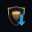

#  Summer add-ons round-up: castle-breaking, magic-deflecting fun from our user community

There are more than 450 add-ons available for 1.16 and this summer saw a lot of activity on the add-on server. Here are some of the highlights from what our user community has created.

## Era of Magic

An update to one of the most popular unofficial eras was released in late May. Era of Magic 3.8.3 brought us five more units and some exciting new treats, like the Mirrorshield's deflect magic ability. Now's a good time to revisit the Al-Kamija, the Kharos, and all the factions from [Era of Magic](https://forums.wesnoth.org/viewtopic.php?t=20039).

## Ashen Hearts

This [challenging campaign](https://forums.wesnoth.org/viewtopic.php?t=44442), which tells the history of the drakes and the secret to their inner fire, is now available for 1.16. Lead Herkarth and his people to the source of a mysterious power effecting the drakes deep in the ancient Heartfang mountains. With custom units, tricky puzzles, and easter eggs, this campaign brings much love to an under-played faction.

## The Great Steppe Era

The team behind this growing era delivered a [major update](https://forums.wesnoth.org/viewtopic.php?p=674958#p674958) (1.4), with innovative new tactics like castle-breaking, unit-pulls and long-range attacks. They have also put together a short campaign, [Ogre Crusaders](https://forums.wesnoth.org/viewtopic.php?t=55391), if you want to cut your teeth on something longer than a single scenario.

## The Unstoppable Legion

A true classic, this add-on may be the most well-written [horse-back campaign](https://forums.wesnoth.org/viewtopic.php?t=55385) ever and it's now available for 1.16. Command a cavalry force and use your mobility to outflank and defeat an unstoppable legion of cultists, soldiers, and creatures of the night.

## Eastern Europe at War

This unique era features more than [200 historical units](https://forums.wesnoth.org/viewtopic.php?t=34418) in more than a dozen factions inspired by 18th century warfare in Europe. A new major version was just released and the maintainers are looking for more contributors.

## Struggle for Freedom

Another classic, this [elf/human campaign is back](https://forums.wesnoth.org/viewtopic.php?t=55264) after several years being unmaintained. It has been rebuilt to use units from the [War of Legends](https://forums.wesnoth.org/viewtopic.php?t=30087) era, and features dungeon-crawling scenarios and small-squad gameplay.

## How to play an add-on

Follow these steps to install an add-on and play it.

1. From the main menu, click **Add-ons**.
2. Click **Connect** to join `addons.wesnoth.org`, the official add-on server.
3. Browse or search the list of add-ons.
4. Click on the add-on to read more about it.
5. Click  to install the add-on.
6. Click **Exit** to return to the main menu.

Once your add-on is installed, you can play it like any other game of Wesnoth. Campaign add-ons can be found in the campaigns menu. Multiplayer eras and scenarios are available when you start a multiplayer game.

## Got a fun idea?

Every add-on starts with a good idea. Here's how to [get started](https://wiki.wesnoth.org/Create) making your own maps, units, scenarios and campaigns.