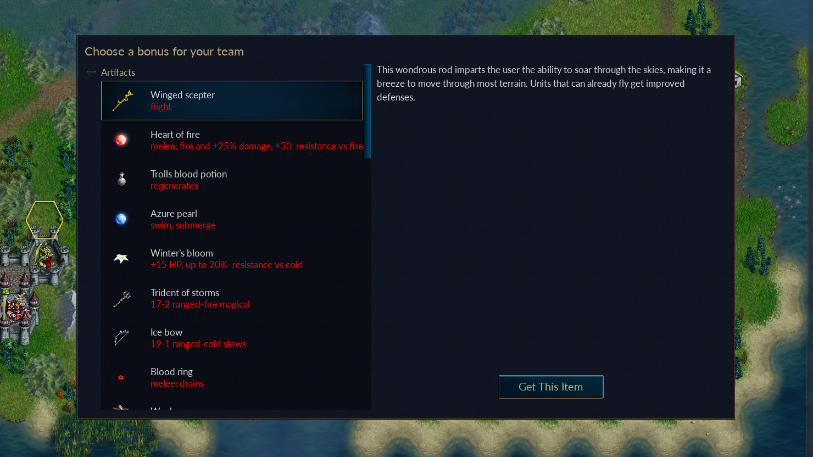
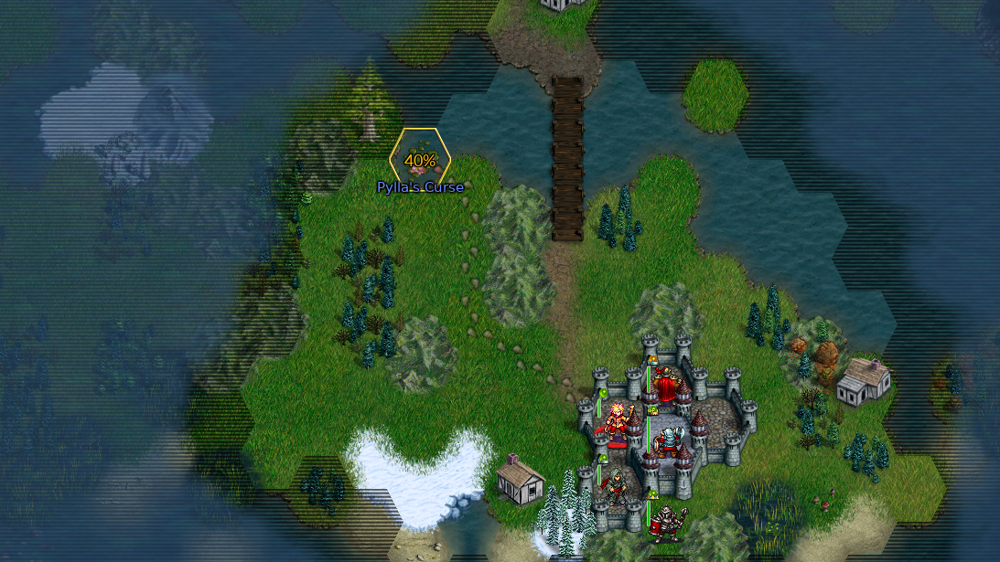

# World Conquest: Wesnoth with friends

One of the joys of Wesnoth is amassing an army of high-level recruits over a long campaign. When playing with friends, though, most multiplayer games are short, one-off encounters. When the scenario ends, you can say goodbye to that Red Mage you painstakingly leveled up.

Wouldn't it be great if you could play a whole campaign with friends? Well you can with **World Conquest**, a randomly-generated coop campaign for 1-3 players. Since including it in our 1.16 release, it's become the second-most popular game on our multiplayer server.

## What to expect

A game of **World Conquest** works like any other Wesnoth campaign. You'll need to seize villages and kill enemy leaders to win. When you recruit your first unit, you can choose bonuses for your side by giving them artifacts, training and heroes.

Every time you win and start a new scenario, you'll get to choose another set of bonuses. Choose carefully! The right bonus combos can really increase the power of your units.

## A different campaign every time

Every campaign in **World Conquest** is randomly generated -- random maps, random enemies, random heroes, random bonuses. It's a great way to try out a new strategy or faction, like the Dunefolk we introduced in the last release.

## How to play

To start a new coop game of **World Conquest**, follow these steps.

1. From the Main Menu click **Multiplayer**.
2. Select **Join Official Server** and click ok.
3. Once you're in the lobby, click **Create Game**.
4. Find the dropdown that says **Scenarios** and change it to **Multiplayer Campaigns**.
5. Select **World Conquest 2p** (two players) or **World Conquest 3p** (three players) and click **Create Game**.
6. Select your difficulty and click **Play**. (Start on Easy if you're not sure -- World Conquest is _really hard_.)
7. Tell your friend your game room's name so they can join you, or wait for another player.
8. Click **I'm Ready** to start the game.

Remember, this is a campaign and you'll need more than one sitting to finish it!
When you're ready for a break, be sure to save the game before quitting. Go to **Menu > Save Game** and give it a name you can remember.

To resume a saved campaign, follow these steps.

1. From the Main Menu click **Multiplayer**.
2. Select **Join Official Server** and click ok.
3. Once you're in the lobby, click **Create Game**.
4. Click **Load Game** on the left.
5. Find your saved game and click **Load**.
6. Tell your friend your game room's name so they can join you, or wait for another player.
7. Click **I'm Ready** to start the game.

## Want to play alone?

You can play **World Conquest** by yourself. Follow the steps above, but join the **Local Server** in step 2 and select **World Conquest 1p** in your game room.
